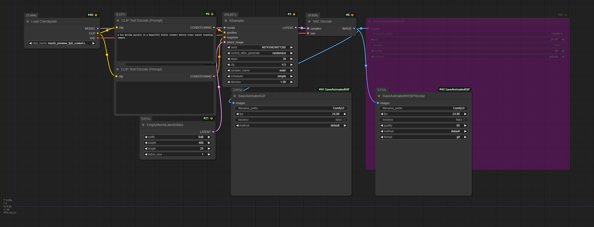

# ComfyUI-SaveAnimatedGIF

## Description

Save animated GIF format nodes in ComfyUI.

**Why I Make This Nodes**

When using the example for [mochi](https://comfyanonymous.github.io/ComfyUI_examples/mochi/), I couldn't find a node that directly saves in `GIF` format. Therefore, I modified the official `SaveAnimatedWEBP` node from ComfyUI so that the new node can save in `GIF` format.

I haven't conducted an in-depth search through third-party node libraries, **so this may be a redundant solution—just wanted to share it.**

## Example

You can use the following ComfyUI Workflow to check the functionality of the node.


## Installation

Clone the repository to `custom_nodes`:

```
git clone https://github.com/MakkiShizu/ComfyUI-SaveAnimatedGIF.git
```

nodes path：

- image/animation/SaveAnimatedGIF
- image/animation/SaveAnimatedWEBPRevise

#### License

This project is licensed under the MIT License.

<hr>
